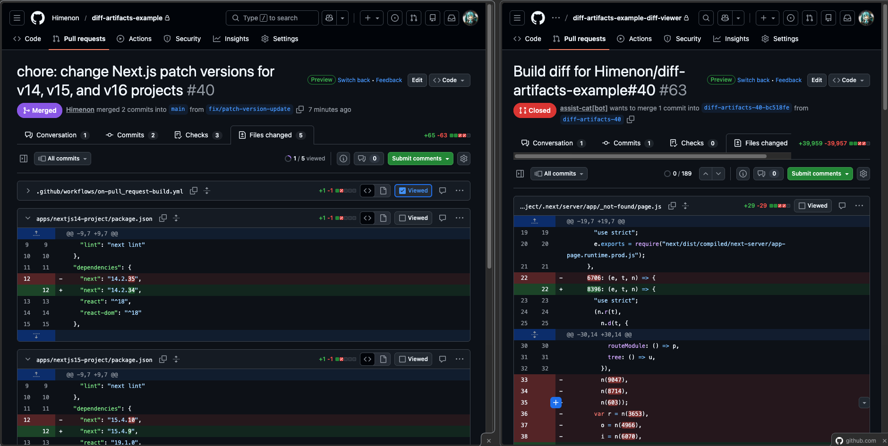

# Diff Artifacts

[English](./README.md)

ビルド成果物の差分をGitHub Pull Requestで視覚的に比較します。
このActionは、変更によって引き起こされる成果物の変更を開発者が認識できることを手助けしてくれます。



**サンプルリポジトリ**

- https://github.com/Himenon/diff-artifacts-example
- https://github.com/Himenon/diff-artifacts-example-diff-viewer

**サンプルPull Request**

- [chore: change Next.js patch versions for v14, v15, and v16 projects #40](https://github.com/Himenon/diff-artifacts-example/pull/40)
- [fix: one word changes #39](https://github.com/Himenon/diff-artifacts-example/pull/39)

## セットアップ

1. [GitHub App](https://docs.github.com/apps/creating-github-apps)を作成し、以下の権限を付与してください。 **Pull requests** (Read/Write), **Contents** (Read/Write)
2. `APP_ID` と `APP_PRIVATE_KEY` をリポジトリシークレットに保存してください。
3. `diff-viewer`用の空のリポジトリを作成してください。

## 使い方

**artifactの比較**

```yaml
on:
  pull_request:

jobs:
  compare:
    runs-on: ubuntu-latest
    steps:
      - uses: Himenon/diff-artifacts/compare@v1.0.0
        with:
          app-id: ${{ secrets.APP_ID }}
          app-private-key: ${{ secrets.APP_PRIVATE_KEY }}
          diff-viewer-owner: "your-username"
          diff-viewer-repo-name: "your-diff-viewer-repo"
```

baseブランチのartifactアップロードとPRの自動クローズも設定できます：

**baseブランチのartifactアップロード**

```yaml
on:
  push:
    branches: [main]

jobs:
  upload:
    runs-on: ubuntu-latest
    steps:
      # ビルドステップ ...
      - uses: Himenon/diff-artifact/upload@v1.0.0
        with:
          path: dist/
```

**diff-artifactsで作成されたPRの自動クローズ**

```yaml
on:
  pull_request:
    types: [closed]

jobs:
  cleanup:
    runs-on: ubuntu-slim
    steps:
      - uses: Himenon/diff-artifact/close-pr@v1.0.0
        with:
          app-id: ${{ secrets.APP_ID }}
          app-private-key: ${{ secrets.APP_PRIVATE_KEY }}
          diff-viewer-owner: "your-username"
          diff-viewer-repo-name: "your-diff-viewer-repo"
```

## 開発者向けメモ

実際のプロダクトで使用する際はリポジトリをCloneしたり、組織内にForkしてカスタマイズして利用することをおすすめします。デフォルトのオプションは最小構成で動作するように設計されており、複雑なワークフローに対応することを想定して作られていないためです。

## ライセンス

[Himenon/diff-artifacts](https://github.com/Himenon/diff-artifacts), MIT
